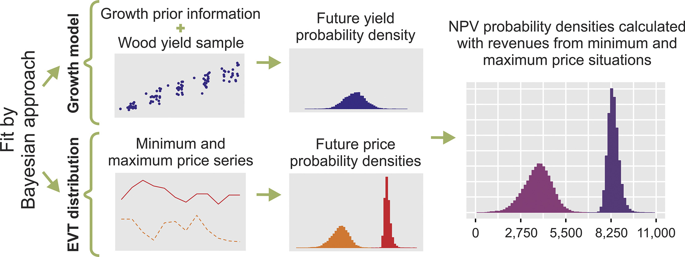

# Bayesian approach and extreme value theory in economic analysis of forestry projects
Research project in which the objective was to use Bayesian approach and EVT to estimate
future price and yield to carry out an economic evaluation of a forestry project.\
This study is published in Forest Policy and Economics. All details about methodology and results
are on [https://doi.org/10.1016/j.forpol.2019.05.021](https://doi.org/10.1016/j.forpol.2019.05.021)\
The R_script contains the execution of the project.

## Highlights
• An unexplored way of estimating yield and price in forestry projects is presented.\
• Bayesian approach and EVT improve traditional project performance assessment.\
• Forest outgrower schemes are economically feasible in situations of extreme price in Brazil.

## Abstract
Reliable estimates of price and wood yield as well as the calculation of economic criteria that include uncertainty are necessary to make the decision-making process more robust when analysing a long-term activity such as forestry. Through extreme value theory EVT combined with Bayesian inference it is possible to predict probability densities for inputs used in economic evaluation criteria like wood yield and prices. With it, uncertainties regarding the inputs can be taken into account in the economic analysis, improving the way they are obtained. Therefore, this study aimed to use Bayesian approach and EVT to estimate future price and yield to carry out an economic evaluation of a forestry project. Yield, maximum and minimum price were estimated in the form of probability density. Considering 95% of probability, the NPV calculated for the minimum price situation ranged from R$ 2050.11 to R$ 5409.07 ha−1, with a mean of R$ 3771.60 ha−1. The NPV calculated for the maximum price situation ranged from R$ 7766.77 to R$ 9070.29 ha−1, with a mean of R$ 8398.13 ha−1. These results serve as best and worst-case scenarios for managers in the case of a eucalyptus plantation established in 2017 under an outgrower scheme in Brazil. The presented methodology provided good results when estimating the variables of interest. It incorporates probability levels and/or prior information. With it, the economic performance of the project and its risks are better visualized and understood by researchers and managers..

## Graphical abstract

